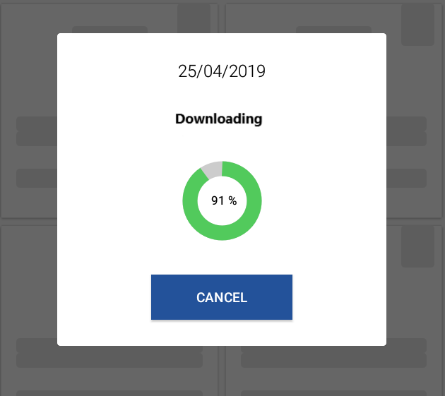

# Percentage Progressbar

<!--  -->

    Percentage Progressbar Library

## 

## 💻 Installation

##### Gradle Groovy DSL

    implementation 'io.github.e4basil:percentageprogressbar:0.1.8'
    
##### Gradle Kotlin DSL

    implementation("io.github.e4basil:percentageprogressbar:0.1.8")
    

## Supported attributes/features
Here is a quick overview of the attributes/features

|Attribute / Feature|Attribute Name |status|
|-----------:|:-----------:|:-----------:|
|progress color     |ppb_progress_color   |✓   |
|secondary progress color   |ppb_secondary_progress_color   |✓   |
|progress bar thickness     |ppb_thickness   |✓   |
|progress bar progress      |ppb_progress  |✓    |
|progress bar max progress    |ppb_progress_max  |✓  |
|progress bar text size     |ppb_text_size    |✓    |
|progress bar text color     |ppb_text_color   |✓   |
|progress bar pre text     |ppb_progress_pre_text    |✓     |
|progress bar post text     |ppb_progress_post_text    |✓    |

